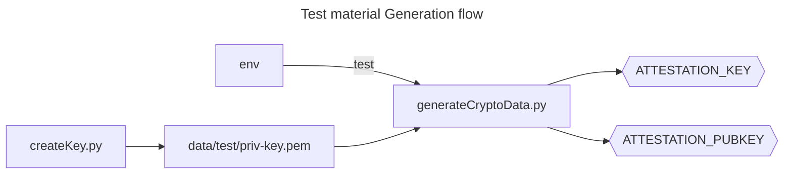
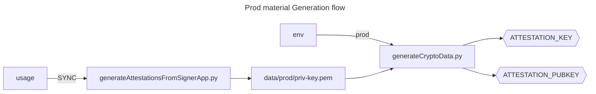

# Generating Keys material

## TEST Private key generation

Then you can run `./createKey.py` to generate the private key:

```shell
$ ./createKey.py -h
usage: createKey.py [-h] [--verbose]

options:
  -h, --help     show this help message and exit
  --verbose, -v  Verbose mode
```

It will generate:

- `key_file="data/test/priv-key.pem"`

The key has already been generated and committed.
It can be accessed from the public repository and **should therefore never be used in production**.

## PROD Private key generation

The PROD key is generated thanks to a special App, with a dedicated script.
The are both located in the repo [app-key-cert-generation](https://git.orange.ledgerlabs.net/embedded-software/app-key-cert-generation).
Here, a README file explains also how to use it.
The script must be executed from the directory `attestation` of the repo `app-ledger-sync`.
The only prerequisite is that the `app-signer` must be compiled, loaded and running on a device.

It will generate

- `key_file="data/prod/priv-key.pem"`

## Hex keys formatting

You can then retrieve the attestation data in a form that should be put in `src/crypto_data.h`.
To do so, use `./generateCryptData.py` to print the data in the terminal:

```shell
$ ./generateCryptoData.py -h
usage: generateCryptoData.py [-h] [--verbose] {prod,test}

positional arguments:
  {prod,test}    CA, key and cert env

options:
  -h, --help     show this help message and exit
  --verbose, -v  Verbose mode
```

This repository contains a `src/crypto_data.h` file that is committed and contains
data from `test` env and public data from `prod` env.

> *Note*: **Never use `test` data in production**.

The `prod` key itself must be included in the Jenkins credential.

## Global keys flow

### `test` env flow



### `prod` env flow


